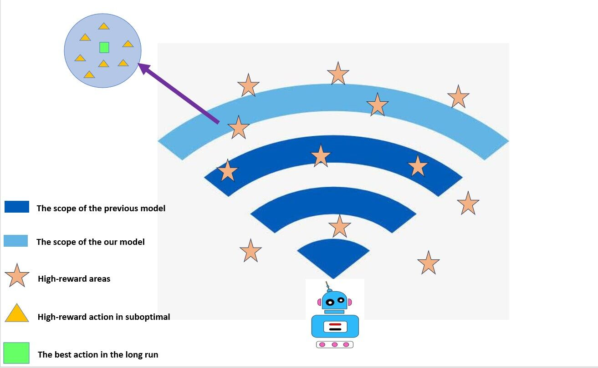

<h2 align="center"> <a href="https://arxiv.org/abs/2312.15965"> Optimistic and Pessimistic Actor in RL:Decoupling Exploration and Utilization</a></h2>
<h4 align="center">
  <a href="">Jingpu Yang</a><sup>1</sup>, 
  <a href="">Qirui Zhao</a><sup>2</sup>, 
  <a href="">Helin Wang</a><sup>3</sup>, 
  <a href="">Yuxiao Huang</a><sup>4</sup>, 
  <a>Zirui Song</a><sup>5</sup>, 
  <a href="">Miao Fang</a><sup>6</sup>
</h4>
<ul align="center">
</ul>


<h5 align="center">

[](https://arxiv.org/abs/2312.15965)


## Introduction
Deep neural network (DNN) generalization is limited
by the over-reliance of current offline reinforcement learning
techniques on conservative processing of existing datasets. This
method frequently results in algorithms that settle for suboptimal
solutions that only adjust to a certain dataset. Similarly, in online
reinforcement learning, the previously imposed punitive pes-
simism also deprives the model of its exploratory potential. Our
research proposes a novel framework, Optimistic and Pessimistic
Actor Reinforcement Learning (OPARL) OPARL employs a
unique dual-actor approach: an optimistic actor dedicated to
exploration and a pessimistic actor focused on utilization, thereby
effectively differentiating between exploration and utilization
strategies. This unique combination in reinforcement learning
methods fosters a more balanced and efficient approach. It
enables the optimization of policies that focus on actions yielding
high rewards through pessimistic utilization strategies, while
also ensuring extensive state coverage via optimistic exploration.
Experiments and theoretical study demonstrates OPARL im-
proves agents’ capacities for application and exploration. In the
most tasks of DMControl benchmark and Mujoco environment,
OPARL performed better than state-of-the-art methods.

## Effect


## Installation
<a href="https://github.com/google-deepmind/dm_control"> Click here to install the environment of this project</a></h2>

## Operation
```
run python main.py
```