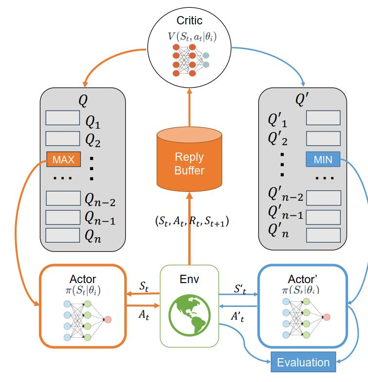
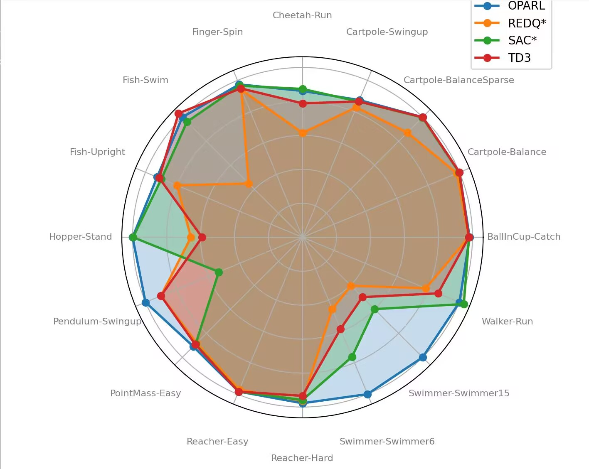
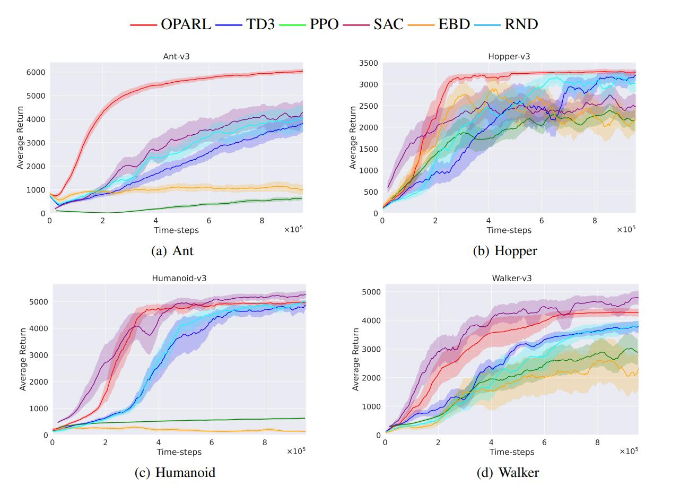
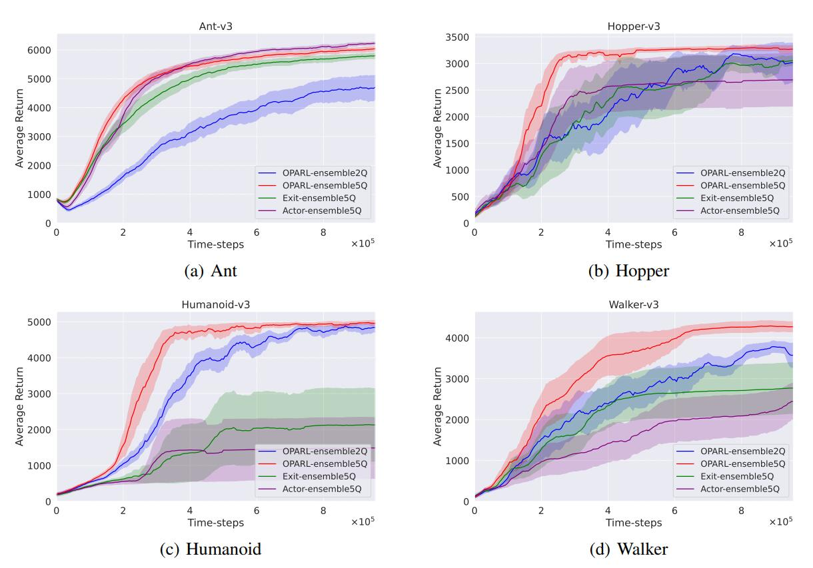
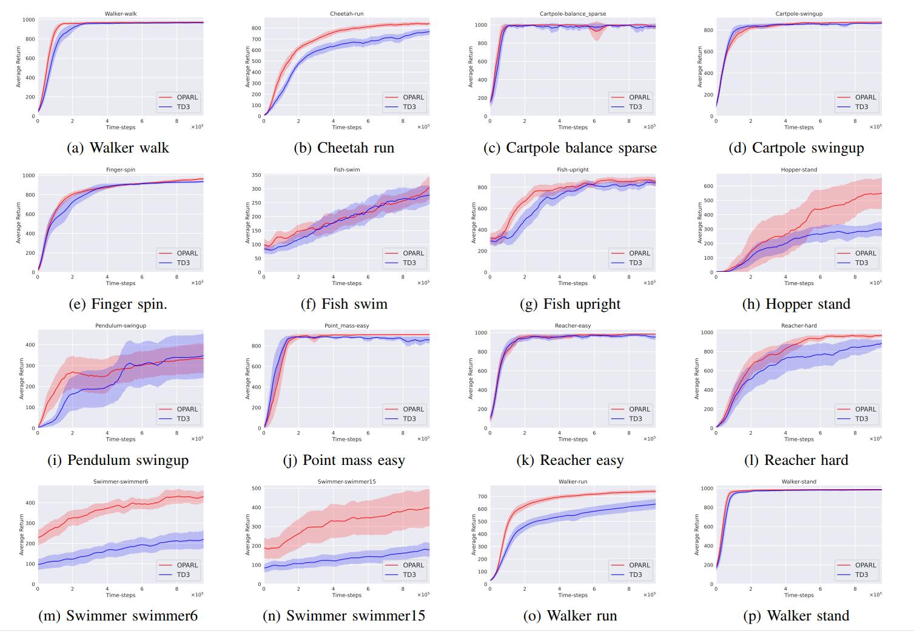

<h2 align="center"> <a href="https://arxiv.org/abs/2312.15965"> OEfficient Reinforcemen Learning via Decoupling Exploration and Utilization</a></h2>
<h4 align="center">
  <a href="">Jingpu Yang</a><sup>1</sup>, 
  <a href="">Qirui Zhao</a><sup>2</sup>, 
  <a href="">Helin Wang</a><sup>3</sup>, 
  <a href="">Yuxiao Huang</a><sup>4</sup>, 
  <a href="https://ziruisongbest.github.io/">Zirui Song</a><sup>5</sup>, 
  <a href="">Miao Fang</a><sup>6</sup>
</h4>
<ul align="center">
</ul>


<h5 align="center">

[](https://arxiv.org/abs/2312.15965)


## Introduction
This paper mainly discusses the application of reinforcement learning (RL) in single-agent and multi-agent environments, as well as the success of deep reinforcement learning in various fields. In single-agent training, DQN surpassed human-level performance in Atari video games, while Alpha defeated numerous professional players in the game of Go. However, single-agent training encounters some issues, such as the divergence in data distribution between training and testing environments, leading to significant impact from extrapolation errors in traditional RL algorithms. This results in overestimation of Q-values for Out-Of-Distribution (OOD) state-action pairs, causing the agent to erroneously prioritize these overestimated actions. Additionally, the imbalance between exploration and exploitation strategies can lead to diminished model generalization capabilities.

## exploration
<div style="text-align:center;">  
      
</div>  

## Installation
<a href="https://github.com/google-deepmind/dm_control"> Click here to install the environment of this project</a></h2>

## Operation
### Usage
The paper results can be reproduced by running:
```
./run_experiments.sh
```
Experiments on single environments can be run by calling:
```
python main.py --env HalfCheetah-v3
```

Hyper-parameters can be modified with different arguments to main.py. We include an implementation of DDPG (DDPG.py), which is not used in the paper, for easy comparison of hyper-parameters with TD3. This is not the implementation of "Our DDPG" as used in the paper (see OurDDPG.py). 

Algorithms which TD3 compares against (PPO, TRPO, ACKTR, DDPG) can be found at [OpenAI baselines repository](https://github.com/openai/baselines). 

### Results
Code is no longer exactly representative of the code used in the paper. Minor adjustments to hyperparamters, etc, to improve performance. Learning curves are still the original results found in the paper.
Learning curves found in the paper are found under /learning_curves. Each learning curve are formatted as NumPy arrays of 201 evaluations (201,), where each evaluation corresponds to the average total reward from running the policy for 10 episodes with no exploration. The first evaluation is the randomly initialized policy network (unused in the paper). Evaluations are peformed every 5000 time steps, over a total of 1 million time steps. 

Numerical results can be found in the paper, or from the learning curves. Video of the learned agent can be found [here](https://youtu.be/x33Vw-6vzso). 

The result of **DMC**,**Mujoco** environment and **Ablation Study** are listed below:

#### i) Table: Performance Comparison in DMControl Training



| **Domain**   | **Task**       | **OPARL**          | **REDQ***       | **SAC***        | **TD3**        |
|--------------|----------------|--------------------|-----------------|-----------------|----------------|
| BallInCup    | Catch          | **983.8 ± 3.8**    | 978.8 ± 3.7     | 980.3 ± 3.4     | 979.2 ± 1.0    |
| Cartpole     | Balance        | **999.8 ± 0.0**    | 984.0 ± 6.0     | 997.7 ± 1.5     | **999.8 ± 0.0**|
| Cartpole     | BalanceSparse  | **1000.0 ± 0.0**   | 872.1 ± 262.7   | 997.6 ± 5.7     | **1000.0 ± 0.0**|
| Cartpole     | Swingup        | **874.6 ± 7.5**    | 828.1 ± 17.2    | 865.1 ± 1.6     | 865.9 ± 0.8    |
| Cheetah      | Run            | 861.6 ± 21.4       | 614.2 ± 58.2    | **873.4 ± 21.5**| 788.7 ± 50.9   |
| Finger       | Spin           | **974.6 ± 15.5**   | 940.1 ± 33.5    | 966.3 ± 27.1    | 949.0 ± 16.2   |
| Fish         | Swim           | 356.0 ± 65.1       | 159.3 ± 100.1   | 342.4 ± 134.5   | **367.4 ± 59.8**|
| Fish         | Upright        | **926.0 ± 18.6**   | 799.6 ± 113.8   | 898.6 ± 50.4    | 913.0 ± 14.6   |
| Hopper       | Stand          | **599.5 ± 202.2**  | 393.5 ± 225.8   | 597.8 ± 308.8   | 354.4 ± 149.9  |
| Pendulum     | Swingup        | **424.4 ± 155.0**  | 382.6 ± 297.0   | 226.2 ± 228.9   | 382.6 ± 209.3  |
| PointMass    | Easy           | **909.4 ± 8.5**    | 880.9 ± 16.7    | 889.9 ± 33.1    | 892.5 ± 5.2    |
| Reacher      | Easy           | 983.6 ± 1.2        | 970.9 ± 24.4    | 983.5 ± 4.2     | **983.8 ± 1.2**|
| Reacher      | Hard           | **977.5 ± 2.9**    | 964.1 ± 24.0    | 958.6 ± 40.9    | 934.1 ± 71.2   |
| Swimmer      | Swimmer6       | **471.4 ± 60.8**   | 215.8 ± 119.0   | 359.3 ± 130.9   | 275.6 ± 84.9   |
| Swimmer      | Swimmer15      | **442.1 ± 187.5**  | 178.6 ± 116.6   | 264.6 ± 136.9   | 220.4 ± 82.3   |
| Walker       | Run            | 752.1 ± 23.2       | 590.9 ± 51.6    | **773.0 ± 32.9**| 649.3 ± 82.9   |
| Walker       | Stand          | **989.0 ± 2.0**    | 974.0 ± 12.6    | 986.8 ± 2.7     | 984.5 ± 1.3    |
| Walker       | Walk           | **975.3 ± 2.9**    | 957.3 ± 10.6    | 973.5 ± 4.4     | 969.2 ± 2.1    |
| **Average**  | **Scores**     | **805.7**          | 704.7           | 774.1           | 750.5          |
| **Improvements** | **Percentage** | 0.00%           | 14.30%          | 4.08%           | 7.36%          |

#### ii) Performance Curves of Mujoco
  

#### iii) Ablation Performance Curve of Mujoco


### Appendix



### Bibtex

``` bib
@misc{yang2023optimistic,
      title={Optimistic and Pessimistic Actor in RL:Decoupling Exploration and Utilization}, 
      author={Jingpu Yang and Qirui Zhao and Helin Wang and Yuxiao Huang and Zirui Song and Miao Fang},
      year={2023},
      eprint={2312.15965},
      archivePrefix={arXiv},
      primaryClass={cs.LG}
}
```
