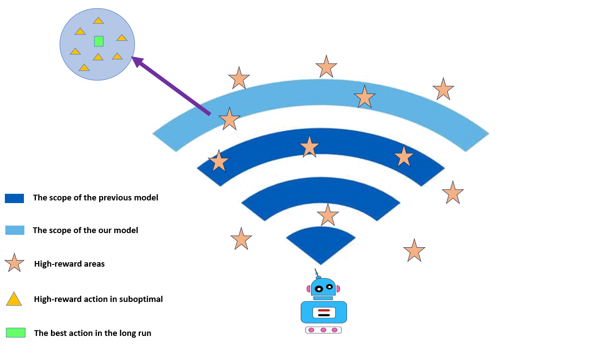
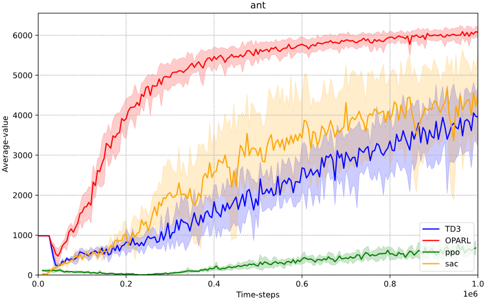
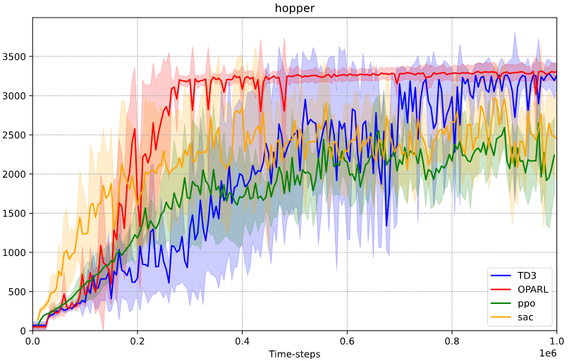
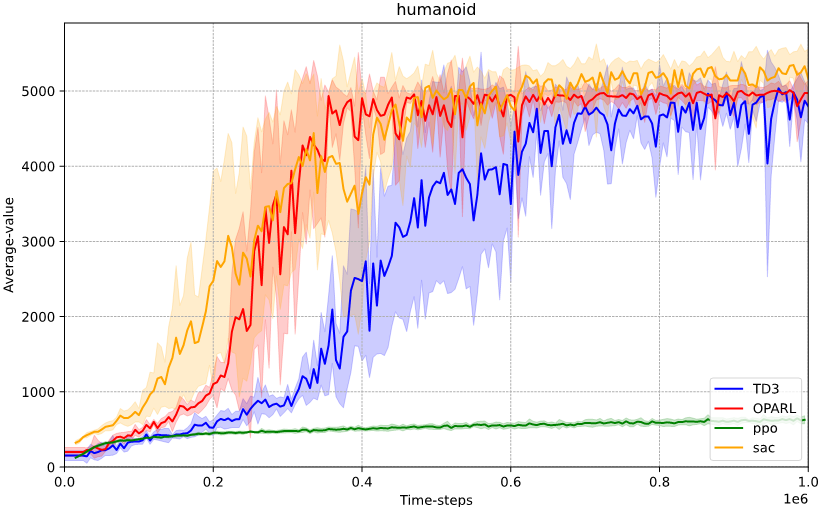
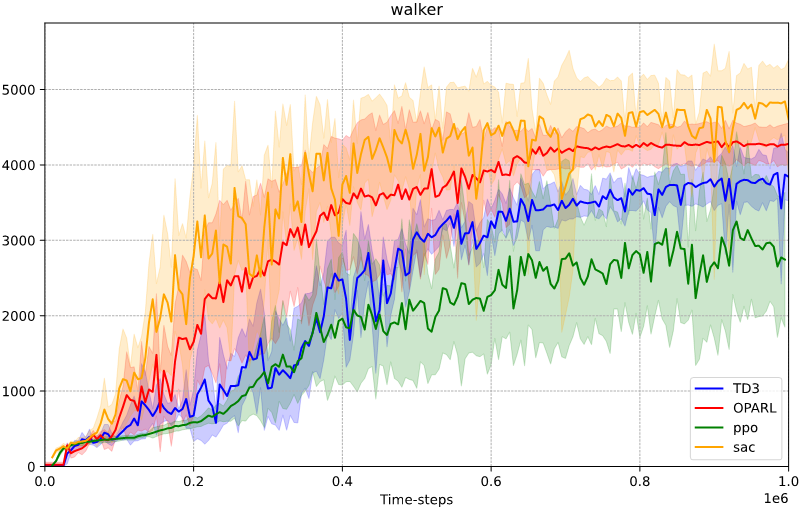
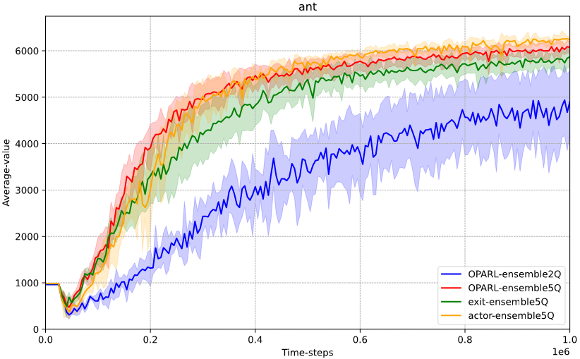
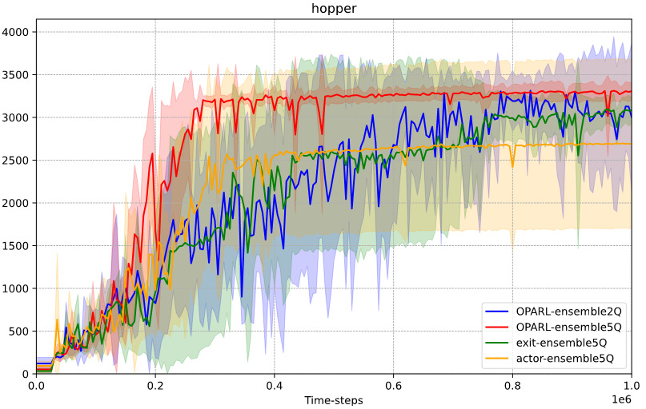
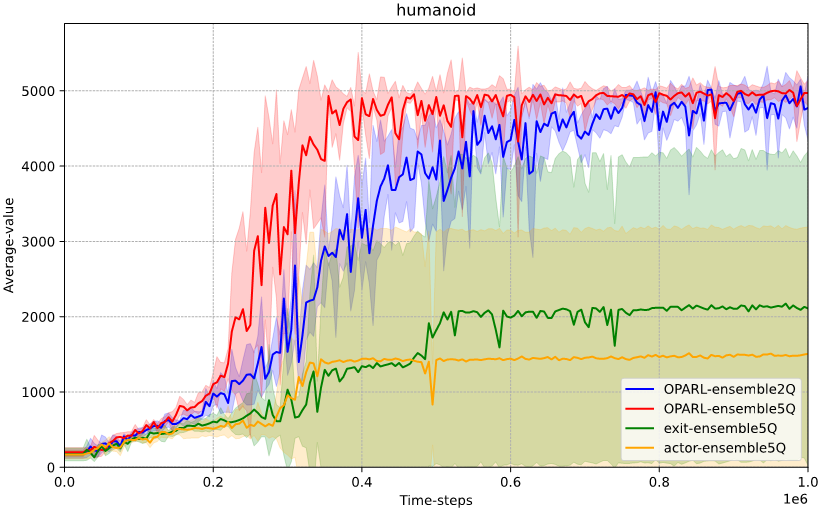
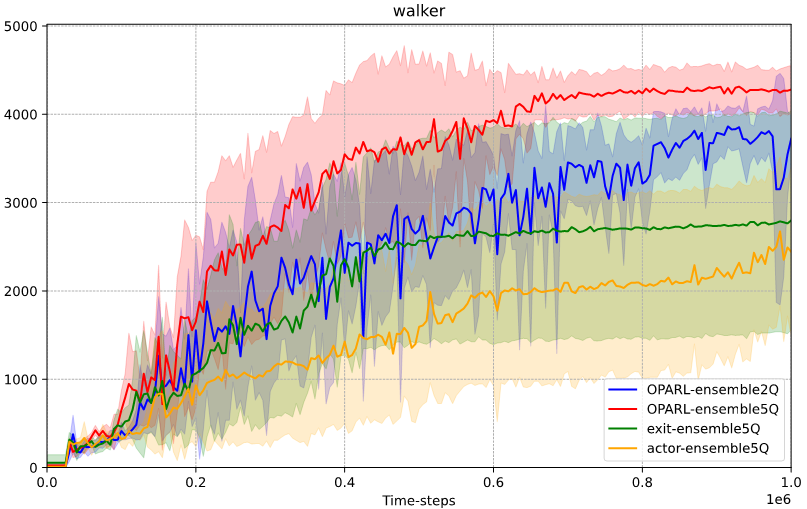

# exploration


# abstract
Deep neural network (DNN) generalization is limited
by the over-reliance of current offline reinforcement learning
techniques on conservative processing of existing datasets. This
method frequently results in algorithms that settle for suboptimal
solutions that only adjust to a certain dataset. Similarly, in online
reinforcement learning, the previously imposed punitive pes-
simism also deprives the model of its exploratory potential. Our
research proposes a novel framework, Optimistic and Pessimistic
Actor Reinforcement Learning (OPARL) OPARL employs a
unique dual-actor approach: an optimistic actor dedicated to
exploration and a pessimistic actor focused on utilization, thereby
effectively differentiating between exploration and utilization
strategies. This unique combination in reinforcement learning
methods fosters a more balanced and efficient approach. It
enables the optimization of policies that focus on actions yielding
high rewards through pessimistic utilization strategies, while
also ensuring extensive state coverage via optimistic exploration.
Experiments and theoretical study demonstrates OPARL im-
proves agents’ capacities for application and exploration. In the
most tasks of DMControl benchmark and Mujoco environment,
OPARL performed better than state-of-the-art methods.
# Addressing Function Approximation Error in Actor-Critic Methods

PyTorch implementation of Twin Delayed Deep Deterministic Policy Gradients (TD3). If you use our code or data please cite the [paper](https://arxiv.org/abs/1802.09477).

Method is tested on [MuJoCo](http://www.mujoco.org/) continuous control tasks in [OpenAI gym](https://github.com/openai/gym). 
Networks are trained using [PyTorch 1.2](https://github.com/pytorch/pytorch) and Python 3.7. 

### Usage
The paper results can be reproduced by running:
```
./run_experiments.sh
```
Experiments on single environments can be run by calling:
```
python main.py --env HalfCheetah-v3
```

Hyper-parameters can be modified with different arguments to main.py. We include an implementation of DDPG (DDPG.py), which is not used in the paper, for easy comparison of hyper-parameters with TD3. This is not the implementation of "Our DDPG" as used in the paper (see OurDDPG.py). 

Algorithms which TD3 compares against (PPO, TRPO, ACKTR, DDPG) can be found at [OpenAI baselines repository](https://github.com/openai/baselines). 

### Results
Code is no longer exactly representative of the code used in the paper. Minor adjustments to hyperparamters, etc, to improve performance. Learning curves are still the original results found in the paper.
Learning curves found in the paper are found under /learning_curves. Each learning curve are formatted as NumPy arrays of 201 evaluations (201,), where each evaluation corresponds to the average total reward from running the policy for 10 episodes with no exploration. The first evaluation is the randomly initialized policy network (unused in the paper). Evaluations are peformed every 5000 time steps, over a total of 1 million time steps. 

Numerical results can be found in the paper, or from the learning curves. Video of the learned agent can be found [here](https://youtu.be/x33Vw-6vzso). 

The result of **DMC**,**Mujoco** environment and **Ablation Study** are listed below:

#### i) Table: Performance Comparison in DMControl Training

| **Domain**   | **Task**       | **OPARL**          | **REDQ***       | **SAC***        | **TD3**        |
|--------------|----------------|--------------------|-----------------|-----------------|----------------|
| BallInCup    | Catch          | **983.8 ± 3.8**    | 978.8 ± 3.7     | 980.3 ± 3.4     | 979.2 ± 1.0    |
| Cartpole     | Balance        | **999.8 ± 0.0**    | 984.0 ± 6.0     | 997.7 ± 1.5     | **999.8 ± 0.0**|
| Cartpole     | BalanceSparse  | **1000.0 ± 0.0**   | 872.1 ± 262.7   | 997.6 ± 5.7     | **1000.0 ± 0.0**|
| Cartpole     | Swingup        | **874.6 ± 7.5**    | 828.1 ± 17.2    | 865.1 ± 1.6     | 865.9 ± 0.8    |
| Cheetah      | Run            | 861.6 ± 21.4       | 614.2 ± 58.2    | **873.4 ± 21.5**| 788.7 ± 50.9   |
| Finger       | Spin           | **974.6 ± 15.5**   | 940.1 ± 33.5    | 966.3 ± 27.1    | 949.0 ± 16.2   |
| Fish         | Swim           | 356.0 ± 65.1       | 159.3 ± 100.1   | 342.4 ± 134.5   | **367.4 ± 59.8**|
| Fish         | Upright        | **926.0 ± 18.6**   | 799.6 ± 113.8   | 898.6 ± 50.4    | 913.0 ± 14.6   |
| Hopper       | Stand          | **599.5 ± 202.2**  | 393.5 ± 225.8   | 597.8 ± 308.8   | 354.4 ± 149.9  |
| Pendulum     | Swingup        | **424.4 ± 155.0**  | 382.6 ± 297.0   | 226.2 ± 228.9   | 382.6 ± 209.3  |
| PointMass    | Easy           | **909.4 ± 8.5**    | 880.9 ± 16.7    | 889.9 ± 33.1    | 892.5 ± 5.2    |
| Reacher      | Easy           | 983.6 ± 1.2        | 970.9 ± 24.4    | 983.5 ± 4.2     | **983.8 ± 1.2**|
| Reacher      | Hard           | **977.5 ± 2.9**    | 964.1 ± 24.0    | 958.6 ± 40.9    | 934.1 ± 71.2   |
| Swimmer      | Swimmer6       | **471.4 ± 60.8**   | 215.8 ± 119.0   | 359.3 ± 130.9   | 275.6 ± 84.9   |
| Swimmer      | Swimmer15      | **442.1 ± 187.5**  | 178.6 ± 116.6   | 264.6 ± 136.9   | 220.4 ± 82.3   |
| Walker       | Run            | 752.1 ± 23.2       | 590.9 ± 51.6    | **773.0 ± 32.9**| 649.3 ± 82.9   |
| Walker       | Stand          | **989.0 ± 2.0**    | 974.0 ± 12.6    | 986.8 ± 2.7     | 984.5 ± 1.3    |
| Walker       | Walk           | **975.3 ± 2.9**    | 957.3 ± 10.6    | 973.5 ± 4.4     | 969.2 ± 2.1    |
| **Average**  | **Scores**     | **805.7**          | 704.7           | 774.1           | 750.5          |
| **Improvements** | **Percentage** | 0.00%           | 14.30%          | 4.08%           | 7.36%          |

#### ii) Performance Curves of Mujoco


#### iii) Ablation Performance Curve of Mujoco


### Bibtex

``` bib
@misc{yang2023optimistic,
      title={Optimistic and Pessimistic Actor in RL:Decoupling Exploration and Utilization}, 
      author={Jingpu Yang and Qirui Zhao and Helin Wang and Yuxiao Huang and Zirui Song and Miao Fang},
      year={2023},
      eprint={2312.15965},
      archivePrefix={arXiv},
      primaryClass={cs.LG}
}
```
